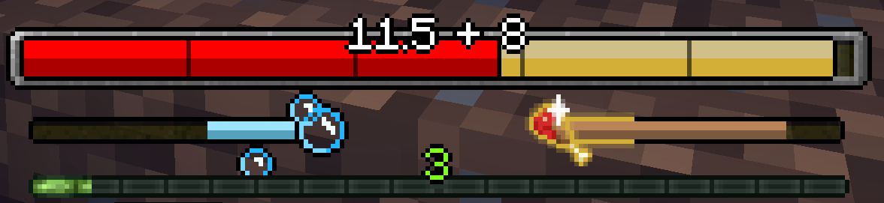

A Minecraft mod that restyles some HUD elements. Most notably, it replaces the small health display with a big health
bar.

All new HUD elements can be freely moved around to suit one's preferences,
and can also be selectively enabled or disabled to keep some vanilla HUD elements if desired.

## Health Bar

The health bar show current health as a bar relative to the player's maximum health.
It also shows the Regeneration, Wither, and Poison status effects as overlays or bar recolors.

Absorption is also displayed in and/or behind the bar, depending on mod settings.
There's also a setting to limit the number of extra absorption bars added top prevent blocking the screen
with tons of absorption health.

It also optionally displays health and absorption as a number on top of the bar.

## Air, Food, and Mount Health Bars

Smaller bars replace the vanilla breath, hunger, and mount health displays.

The breath bar can optionally be hidden if water breathing is active.
Resource packs can also change its texture with water breathing active.

The hunger bar shows saturation level and the Hunger status effect. Note that the saturation level is inaccurate,
because vanilla servers, including the singleplayer server, do not send saturation updates to clients often.

Mount health can optionally be displayed as a number on top of the bar as well.
This bar is independent of other bars, i.e. does not override any other bar like in vanilla.

## Other Features

Two vanilla HUD elements can be rearranged using this mod: the "held item tooltip" that shows the name of the current
item, and the "messages" display which shows some short-lasting messages like being unable to sleep when there are
monsters nearby.

This allows moving these displays out of the way of the new bars, especially the big health bar.

## Installation Notes

This mod is currently only available for Fabric. It furthermore
requires [Fabric API](https://www.curseforge.com/minecraft/mc-mods/fabric-api) to run.

To be able to change this mod's settings in game, [Mod Menu](https://www.curseforge.com/minecraft/mc-mods/modmenu)
and [Cloth Config API](https://www.curseforge.com/minecraft/mc-mods/cloth-config) need to be installed. The config
screen can then be accessed as usual via Mod Menu.

## Resource Pack Compatibility

All elements can be restyled extensively with resource packs. For example, I made a RP to make it fit in with the
[Dokucraft Dwarven RP](https://dokucraft.co.uk/resource-packs/dwarven)
(which I cannot share unfortunately due to Dokucraft's confusing licensing):

### Misc RP Notes

The size of the health bar depends entirely on the aspect ratio of the `health.png` texture.
Its height is assumed to be 32 "HUD pixels" (two times the size of an item), and the width is calculated from that.
For example, my custom PR uses a texture of 360x64 pixels to get a double-resolution health bar with a width of 180 "HUD
pixels", while the default texture size is 184x32.

All other health bar textures should either use the same dimensions,
or in case of overlays like `wither.png` add the texture's height to the width
(and 32x32 textures should obviously stay square).

Similarly, other bars' sizes also depend on their "main" texture's aspect ratio, e.g. `breath.png` for the breath bar.

If a texture has some `_0`, `_10` etc. variants, those represent the minimum value of that bar to show that texture.
You can use as many of these textures as desired, and they will all be used appropriately.

Note that all such textures must come from the same RP, overriding is deliberately disabled
so that you can choose whatever levels you need independent of the base textures or other RPs without interference.
If you don't want different textures, just make a base texture and a `_0` variant.